# ☁️ ENTENDENDO SOBRE SEGURANÇA E IDENTIDADE NO AZURE  
 

  

---  
## ⏯️ INTRODUÇÃO  

Neste laboratório do bootcamp <i>Azure Essencials</i>, foram abordadas questões referentes à segurança e identidade no portal <a href='https://portal.azure.com/'><i>Microsoft Azure</i></a>. Através do projeto, foram explorados os serviços Microsoft Entra ID e Microsoft Defender for Cloud. 
     

  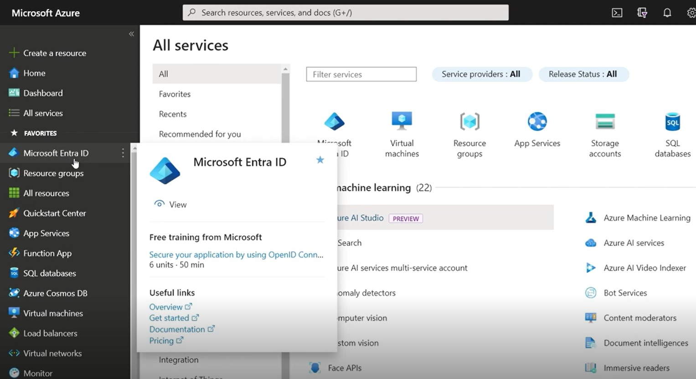 

--- 
## 🗒️RESUMO DOS TÓPICOS:  

- Microsoft Entra ID é responsável por represar os usuários, assim, se existe um ambiente on premise e estão sendo criados recursos no Azure, é indicado manter as mesmas autenticações nos dois lugares, para evitar criar novos usuários no ambiente de nuvem. Uma conta de usuário criada na nuvem não é replicada para on premise, pois só é possível trazer as senhas da nuve de usuários sincronizados.
     

  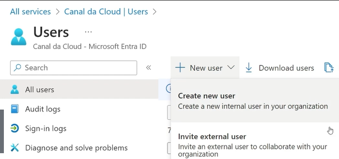 

- As regras e as políticas de RBAC (<i>Role Based Acess Control</i>) estão relacionadas ao permissionamento que há dentro da nuvem para executar determinadas ações, como criação e exclusão de recursos, o que o usuário consegue fazer em relação a outras contas (por ex., permissão para resetar senha de outras pessoas). <b>É diferente das Regras e Administradores do Entra ID.</b>
 

   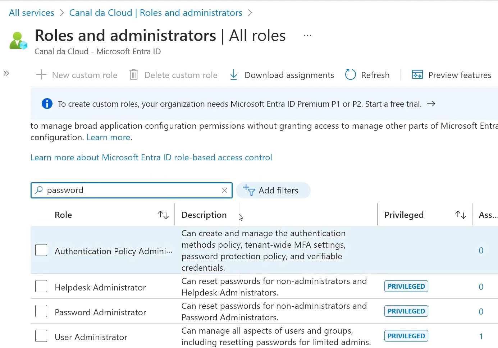

- Quanto ao Entra ID, é uma solução de identidade e acesso que pode incluir RBAC, mas também oferece outras funcionalidades, como autenticação multifator e gerenciamento de identidades. As regras e administradores no Entra ID podem ser mais específicas e detalhadas, focando na gestão de identidades e acessos dentro de um ambiente corporativo.
      

  
  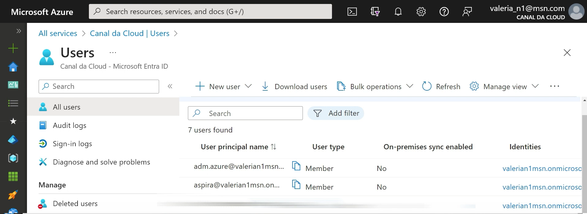

- O RBAC é um método de controle de acesso que atribui permissões aos usuários com base em suas funções dentro de uma organização. Inclui ações como criação e exclusão de recursos na nuvem, permissões específicas, como a capacidade de redefinir senhas de outros usuários.
    

 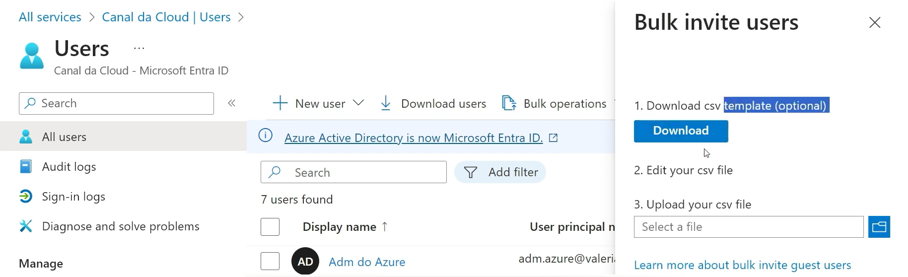

- <b>RBAC</b> é um conceito amplo e pode ser aplicado em diferentes contextos, não apenas na nuvem. É usado para gerenciar o acesso a recursos de TI em geral, garantindo que os usuários tenham apenas as permissões necessárias para realizar suas tarefas.
     

  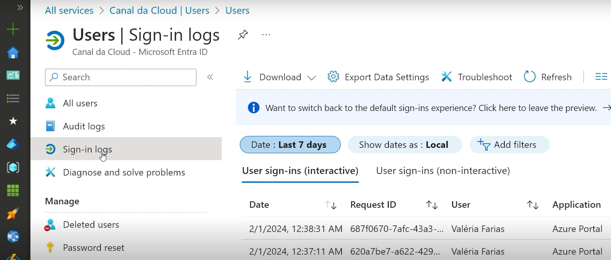

- A exclusão de usuários do Entra ID pode ocorrer 30 dias depois de ser deletados, sendo passível de recuperação neste período, como quando um funcionário é desligado, a exclusão definitiva ocorre automaticamente. 
    

  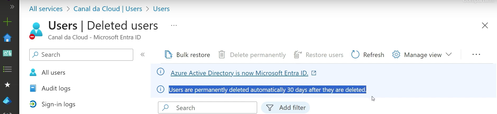 

- Com o Self-Service Password Reset, o próprio usuário consegue recuperar a senha perdida. Também é possível criar usuários e convidar usuários para colaborar na empresa, como em auditorias, inclusive utilizando aruivo CSV com os dados para fazer convite de um grupo de novos usuários.
    

  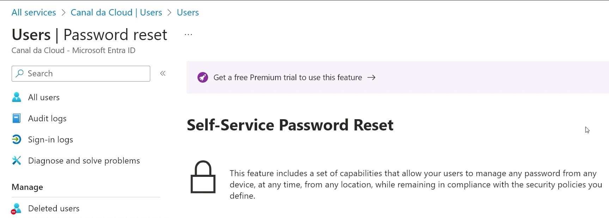

- Numa organização, o ideal é eu não utilize o modelo Free do Entra ID, pois este não oferece muitas ferramentas de controle de serviços e usuários. O mínimo deveria ser uma licença Premium P1. 
    

 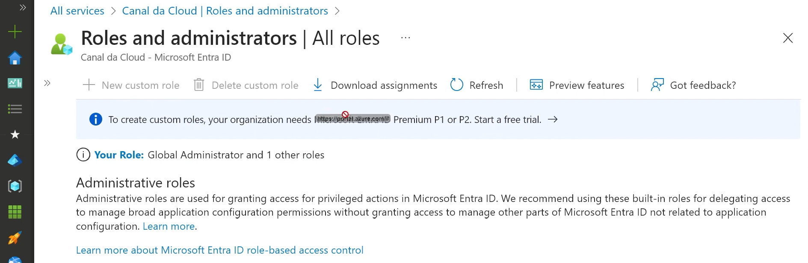  

    

- Microsoft Entra Connect é uma ferramenta que integra diretórios locais com o Entra ID e o Office 365, e permite uma identidade híbrida consistente para acessar recursos na nuvem e no local. 
 

 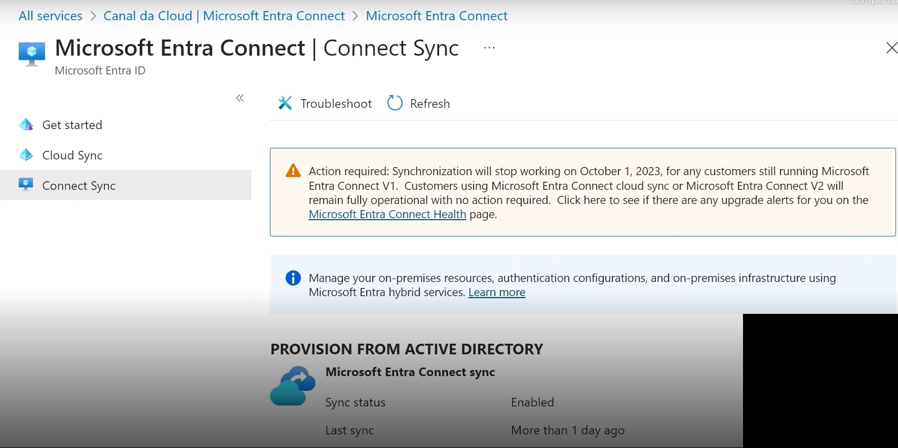  

 

- É possibilitado personalizar o nome do domínio, mediante verificação e consultar a disponibilidade mensal de autenticação do usuário, conforme os percentuais de SLA. O permissionamento dado no resource group é herdado por todos os itens criados dentro dele. 
 

  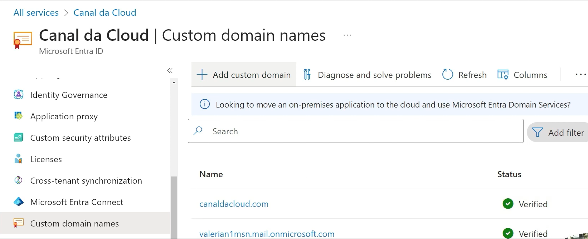
  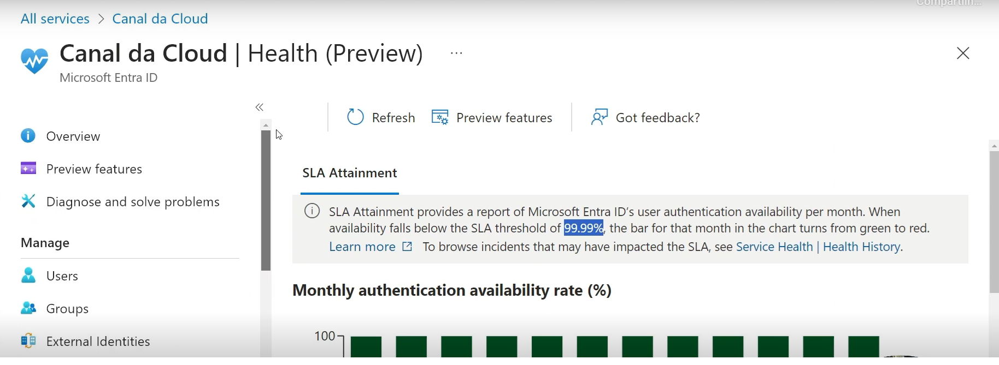

- <b>Microsoft Defender for Cloud</b> funciona como um termômetro, traz uma análise de postura de segurança do usuário. É uma ferramenta cloud native, com configurações específicas para, por exemplo, trazer recomendações de segurança (com notas, recurso DevOps Security), sendo benéfico para a área de software, multicloud e híbrido. Permite conectar às contas de outros provedores de nuvem e, a partir do Azure, fazer uma validação de segurança. 
  

 

- <i>Defender for Cloud</i> pode ser usado junto com o Azure Arc, uma solução da Microsoft que permite a gestão de ambientes híbridos e multinuvem. Ele estende a plataforma Azure para que se possa gerenciar, proteger e operar infraestrutura, aplicativos e serviços do Azure em qualquer lugar, como em datacenters locais, na borda ou em outras nuven. 
  

 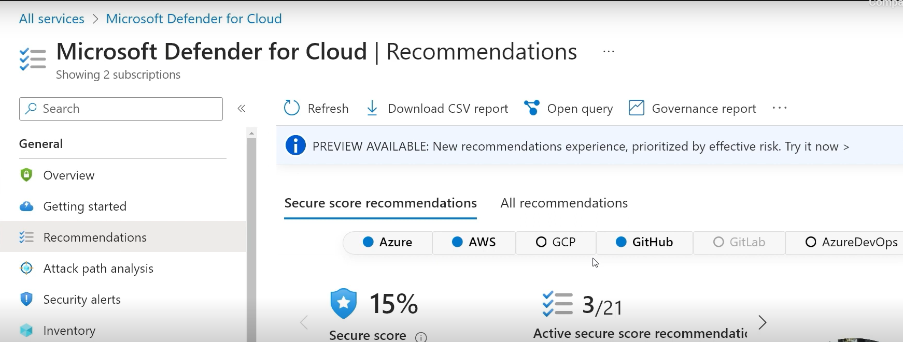

- Além de ser um validador de segurança de outors ambientes, o Defender for  Cloud tem o módulo DevOps Security propicia a conexão com contas do GiHub, GitLab, AWS, GCP e outros para fazer validação enuanto códigos são carregados para a nuvem. Podem ser configurados alertas para enviar por e-mail, Teams, Slack. <i>Defender CSPM</i> é um serviço gratuito para fazer validação de segurança, recomendações de segurança e score de segurança. 

---    
## ✍️ AUTORA    

Carla Edila Silveira  
Contato: rosa.carla@pucpr.edu.br  

---  
## ©️ LICENÇA

[MIT](https://choosealicense.com/licenses/mit/)  

---  
## 🔗 LINKS ÚTEIS  

- [Novo nome para o Azure Active Directory](https://learn.microsoft.com/pt-br/entra/fundamentals/new-name)
- [O que é o Microsoft Defender para Nuvem?](https://learn.microsoft.com/pt-br/azure/defender-for-cloud/defender-for-cloud-introduction)
- [Como funciona: Redefinição de senha self-service do Microsoft Entra](https://learn.microsoft.com/pt-br/entra/identity/authentication/concept-sspr-howitworks)
  
---
